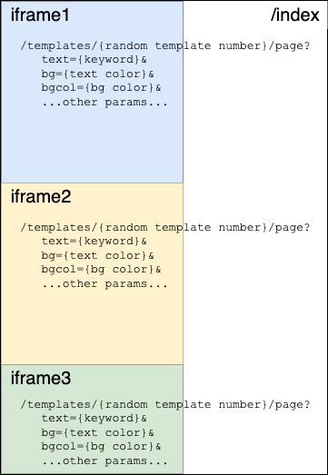
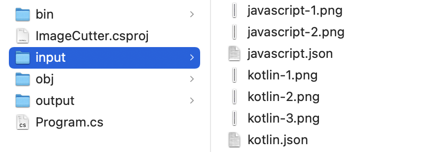
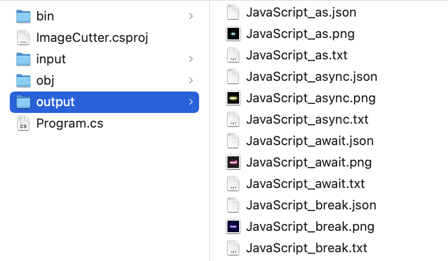
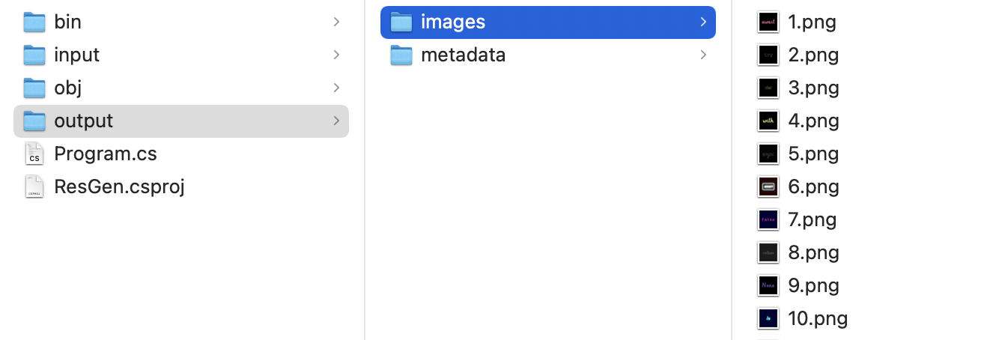
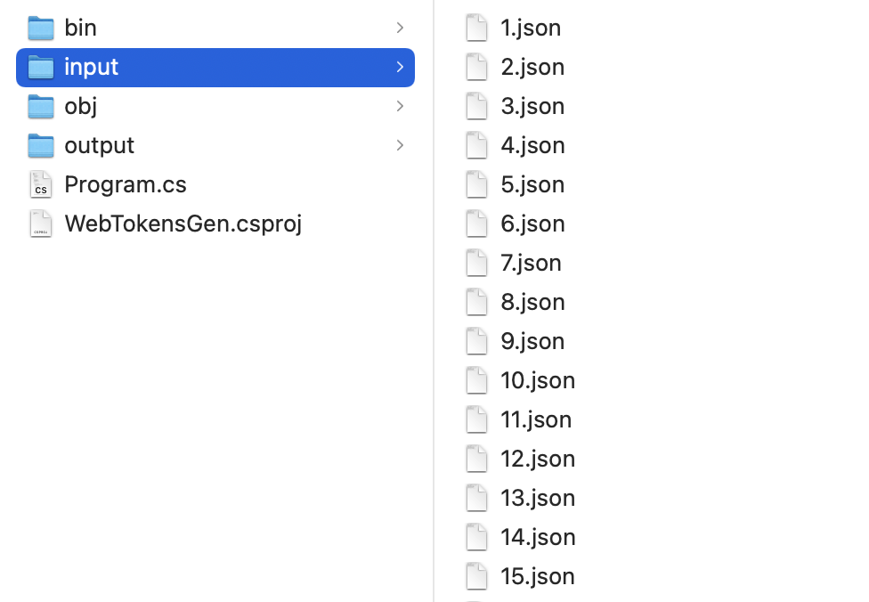

# Welcome to the Ninja Developer's tools

This repository contains all the tools used to dynamically generate the keyword images/metadata for the [Ninja Developer Hacking Squad's NFT collection](https://ninjadeveloper.xyz).

The Ninja Developer Hacking Squad is an ironic website about the mythical "ninja developer", and its NFT collection comprises 1024 ERC-721 tokens on the Ethereum blockchain, representing keywords of the most used programming languages.

> NOTE: the code for the website/API is also available in a separate repo under the [NinjaDevHS GitHub account](https://github.com/NinjaDevHS).

There are 4 tools, which are used one after the other, for the different steps in the generation process:
1. **KeywordsGen**: an ASP.NET Core 6 website with a page that renders all the keywords of a certain programming language, with a randomly selected style (colors, font, background pattern etc.).
2. **ImageCutter**: a .NET 6 / C# command-line utility that generates the individual image/metadata files from the output of step #1.
3. **ResGen**: a .NET 6 / C# command-line utility that shuffles the image/metadata files generated by step #2, and names the files after a sequential number (eg: 1.png/1.json etc.). It also modifies the metadata json with the IPFS folder name, which is only known after the image files are finalized and uploaded to IPFS through a gateway like [Pinata](https://www.pinata.cloud/).
4. **WebTokensGen**: a .NET 6 / C# command-line utility that creates a single .json file with the metadata of all keywords of all languages. This file is consumed by the [Ninja Developer Hacking Squad website](https://ninjadeveloper.xyz), for the keywords page that becomes available once the initial minting is sold out. In fact, this is not really something that's part of the process to generate the NFT assets.

> NOTE: all these tools were developed and tested on macOS, but .NET Core 6.0 is cross-platform and runs on macOS, Windows and Linux.

Keep reading for details about each step...and check out our [Twitter feed](https://twitter.com/NinjaDevHS) for more info about web3 development and to get in touch with us.

## 1. Generating the raw images

To generate text-based images with random styles we could have created a script that used the popular [ImageMagick](https://imagemagick.org/index.php) OSS command-line tool, but creating a style that looked exactly like we wanted would have been complex (maybe impossible?), and the process of writing some code, executing the script and checking the preview would have been too annoying.

Alternatively we could have scripted Photoshop, but we didn't want to depend on such a large commercial application.

We wanted something small, super portable, light, and quickly modifiable. In the end, we settled with the idea of rendering text with a webpage and use CSS to style it. Modern CSS and browsers are very powerful and flexible: you can use any font, apply shadows, filters, transformations, animations...

We built 6 different template pages (starting from small examples found around the web, and customizing/extending them), each one rendering a specific style (eg: text with neon effect). The template page takes in input a number of parameters such as the colors to use, the text to render etc., and prints the text centered vertically and horizontally on the page.

Then we built a "controller" page, that creates one iframe for every keyword to be rendered (with a 1000 x 1000px size on a retina display), and each iframe points to one template page (randomly selected) passing the styles (also randomly selected) and the keyword to it. 

Once the pages were ready, we ran the website (with `dotnet run` from the project's root folder `KeywordsGen`) and loaded the following in the browser:

`http://localhost:{port}/?lang={lang}`

which would do the following:



...that in practice renders the page below (as an example, because the actual styles will be different at every load).


Note that there's a `lang` querystring parameter, to only load keywords of a certain language. This is because rendering 1000+ iframes on a single page will be too memory intensive on most consumer machines, and it's just easier to limit the number of frames by loading one language at a time.

> NOTE: as a reference, this entire project and the website were developed on a base model MacBook Air 2020 with the M1 CPU.

At this point, there's some manual work to take the screenshot(s) of the entire long page, which we later cut into individual images. We used the [GoFullPage Chrome extension](https://chrome.google.com/webstore/detail/gofullpage-full-page-scre/fdpohaocaechififmbbbbbknoalclacl), but there are plenty of alternatives; use the one you prefer.

 A downside of this extension is that it won't manage to take a single screenshot for the entire page (again, because of memory constraints), and it will split it into multiple pieces...which is something the next tool in the process has to account for (more on this later).

> NOTE: this manual process of exporting the screenshots could have been automatated, but since it's done just a few times, it didn't seem an investment worth doing...

The final thing that the webpage does is save a json file with the raw data used to generate the images (eg: the #hex color codes, template number etc., not the metadata to be used for the actual NFT), which is used by the next tool to generate the NFT metadata.

#### How to modify / add / remove words and styles
The keywords and their category, as well as all the colors, fonts, styles, and the weight they have in the randomization process, are defined in the `/Pages/index.cshtml` page. Modify that file if you want to define your own set of words to generate an image for. 

Template pages are located under `/Pages/Templates/`. Add your own templates using the existing ones to understand how parameters are passed in input and used to change the style of the word.

## 2. Cutting the images

The C# command-line tool in the `ImageCutter` folder takes in input the json file and images generated in step #1 (to be put into an `input` sub-folder), and outputs the individual images and json metadata files (in an `output` sub-folder).

The caveat is that it expects input images files to be named after `{language}-{index}.png` (such as `javascript-1.png`, `javascript-2.png` etc.), and that it expects them to be 1000px wide and 32000px tall as a maximum. If step #1 produced images that are of a different size, you'll need to adjust the images manually before using this 2nd tool.

> NOTE: we indeed had to do the manual fixing, as the screenshot tool we used didn't allow to split the page into multiple screenshots of a predetermined size. You might have better luck with a better / more flexible tool...but we didn't care too much because while it's not a fun job, you only need to do the manual fixing once and it's a pretty simple job.

Once you have the images in the proper size, put them and the corresponding json file for a given language (eg: `javascript.json`) in the `input` folder:



 ...and run the tool with:

`dotnet run {language}` => eg: `dotnet run javascript`

Finally, you'll find the individual images and the corresponding json files inside the `output` folder.



## 3. Generating the final NFT assets

The metadata json files generated by the ImageCutter is something like the below, with temporary placeholders in place of the image name and the IPFS folder name:

```
{
   "description":"Ninja Developer Hacking Squad",
   "image":"ipfs://_IMGFOLDER_/_IMGID_.png",
   "name":"#_IMGID_",
   "attributes":[
      {
         "trait_type":"Keyword",
         "value":"async"
      },
      {
         "trait_type":"Theme",
         "value":"Miami"
      },
      ...more attributes...
   ]
}
```

Both the image and the metadata files are named after something like `javascript_async.json` / `.png`

What we need to do next is to:
1. Take all images generated in step #2, shuffle them, and rename them after an incremental number, such as `1.png`, `2.png` and so on. The corresponding json files also need to be renamed accordingly. The `_IMGID_` placeholder  needs to be replaced with the image's number.

To do this, go into the `ResGen` folder, that is a 3rd C# command-line tool, and put all the files generated in step #2 into an `input` sub-folder. Then run `dotnet run`, which outputs all final images into `output/images` and all json files into `output/metadata`.



2. All numerated images now need to be uploaded to IPFS. This is technically an optional step, as you could just store images and metadata on your own server...but blockchains are all about decentralization, so it's better to do things properly and store stuff on IPFS. Doing this with [Pinata](https://www.pinata.cloud/) (the free plan is fine) is almost as easy as using Finder or File Explorer, but you can refer to [this video](https://www.youtube.com/watch?v=3jizwk6_m1s) for a demo. Upload the `images` folder on your Pinata's account, and grab the folder ID.

3. Execute the tool again with `dotnet run {folder ID from Pinata}`, which opens again all the metadata files inside `output/metadata`, and replaces the `_FOLDERID_` placeholder with the ID grabbed from Pinata on the previous step.

4. Now that the json files are in their final shape, also upload the `metadata` folder to IPFS with Pinata.

And that's it, you have all the NFT assets on IPFS! You'll probably want to also upload a placeholder image/metadata pair of files for the hidden / pre-reveal state of the minting process, but that's something you'd do manually (and at least for this state you can actually avoid IPFS and just keep things on your server). We'll leave it here because this isn't a tutorial on how to deploy a NFT collection, but YouTube is full of tutorials about the whole process.

## 4. Generating the tokens.json file for the minting website

The 4th and last tool is completely optional, and only needed for the page on the Ninja Developer website that shows all the keywords, after the initial sale has sold out.

> NOTE: feel free to ignore this if you only want to create the assets for a new collection to be distributed through your own minting website, or a 3rd party marketplace.

It's again a C# command-line tool that merges all the json files generated by step #3 into a single `tokens.json` file.

Move into the `WebTokenGen` folder and copy all of step3's output json files into a `input` sub-folder:



...and run `dotnet run` from the terminal.

That's it, you'll find the generated `tokens.json` file in the `output` sub-folder. You'll then have to move this file into the frontend website's API configuration (refer to the repo about the minting website).

## Contact and Follow Us
[Twitter](https://twitter.com/NinjaDevHS)

## Support
[Discord](https://discord.gg/E7wTVDFwPg): you're welcome to report bugs and ask questions about this project...as well as share and discuss ideas, and talk about other web3 and programming topic in general!

Oh, and we have to admit...we'd really appreciate if you could "star" this on GitHub :P

## Other Projects
[OneLauncher](https://onelauncher.com/): a wallet explorer, that shows all tokens together with their metadata, purchase price and current worth.

## DISCLAIMER: USE AT YOUR OWN RISK

This source code is shared for educational purposes only. There is no guarantee that it's bug-free...actually, that's very unlikely. Please make sure you carefully review, understand, and test the code before using it in any production system. Needless to say...but we say it anyway...we take no responsibility for any issue with the code; use it at your own risk.